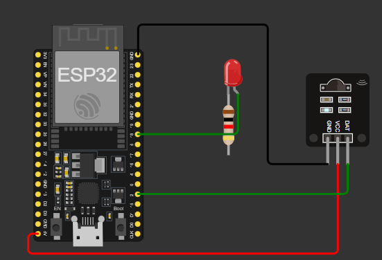

# 🏆 Projeto Acadêmico FIAP – CHALLENGE 2025

**Parceria com o Passa a Bola**

Este é um **projeto acadêmico da FIAP**, desenvolvido como parte do **Challenge 2025**, focado em **monitoramento de gols em tempo real usando IoT**. O sistema integra **ESP32, sensor IR e Node-RED** para criar um painel interativo que registra e visualiza os gols via **MQTT**.

---

## 👥 Integrantes

* João Vitor Parizotto Rocha – RM 562719
* Giovana Bernardino Carnevali – RM 566196
* Alexandre Freitas Silva – RM 566278
* Felipe Rodrigues Gomes Ribeiro – RM 562482
* Artur Distrutti Santos – RM 561319

---

## 🧩 Bibliotecas e Componentes

### ESP32 / Arduino

* [ArduinoJson](https://arduinojson.org/) – serialização e desserialização JSON
* [PubSubClient](https://pubsubclient.knolleary.net/) – comunicação MQTT
* LED – indicador visual de gol
* Sensor IR – para registrar gols



### Node-RED

* Nós utilizados:

  * **MQTT In** – recebe dados do ESP32 (`{"gols": X}`)
  * **Change** – organiza payload (`msg.payload.gols`)
  * **Gauge** – mostra total de gols


---

## ⚙️ Como Executar o Projeto

### 1️⃣ ESP32

1. Conecte o ESP32 ao computador.
2. Abra o **Arduino IDE** e instale as bibliotecas:

   ```text
   ArduinoJson
   PubSubClient
   ```
3. Carregue o código do ESP32 com o **IP do broker MQTT local**:

```cpp
const char* mqtt_server = "192.168.0.11"; // IP da VM/PC com Mosquitto
```

4. Ligue o ESP32 e verifique no Serial Monitor se conecta ao Wi-Fi e ao MQTT.

### 2️⃣ Node-RED

1. Instale o Node-RED ([https://nodered.org](https://nodered.org))
2. Instale o dashboard:
3. Importe o **fluxo Node-RED** fornecido.
4. Configure o nó **MQTT In** com o mesmo **IP do broker local** e o tópico `futebol/gols`.
5. Verifique se o **Gauge** recebe `msg.payload.gols`.

---

## 🎬 Demonstração

* Cada gol detectado pelo ESP32 é enviado como JSON:

```json
{"gols":1}
```

* O **Gauge** mostra o total acumulado.
* LED pisca ao registrar cada gol, dando **feedback visual**.

### 📎 Link Simulação Wokwi

* [https://wokwi.com/projects/442839138106132481](https://wokwi.com/projects/442839138106132481)

### 🎥 Link Vídeo

* [https://youtu.be/RJVUImIFS1E](https://youtu.be/RJVUImIFS1E)

---

## 💡 Observações

* Testes rápidos podem ser feitos usando **Inject node** no Node-RED para simular gols sem sensor físico.
* O projeto pode ser expandido para **FIWARE, HiveMQ** ou qualquer broker MQTT.

---

## 📌 Resumo

Este projeto demonstra como **IoT, MQTT e Node-RED** podem ser integrados para criar **dashboards em tempo real**, promovendo **automação, monitoramento e análise de dados**, totalmente aplicáveis a eventos esportivos ou outras situações de coleta de dados em tempo real.
