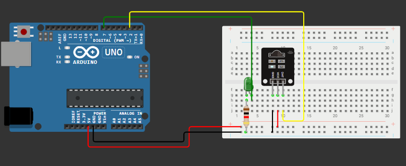
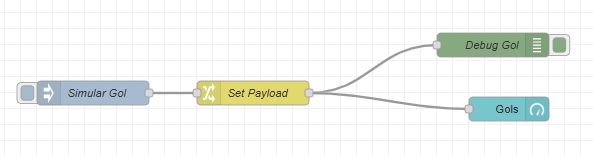

# 🏆 Projeto Acadêmico FIAP – CHALLENGE 2025  
**Parceria com o Passa a Bola**  

Este é um **projeto acadêmico da FIAP**, desenvolvido como parte do **Challenge 2025**, focado em **monitoramento de gols em tempo real usando IoT**. O sistema integra Arduino, sensor de movimento e Node-RED para criar um painel interativo que registra e visualiza os gols.

---

## 👥 Integrantes
- João Vitor Parizotto Rocha – RM 562719  
- Giovana Bernardino Carnevali – RM 566196  
- Alexandre Freitas Silva – RM 566278  
- Felipe Rodrigues Gomes Ribeiro – RM 562482  
- Artur Distrutti Santos – RM 561319  

---

## 🧩 Bibliotecas e Componentes
### Arduino
- [ArduinoJson](https://arduinojson.org/) – para serialização e desserialização JSON  
- LED – indicador visual de gol  
- Sensor de movimento / IR – para registrar gols



### Node-RED
- `node-red-dashboard` – para criar o painel interativo  
- Nós utilizados:
  - **Inject** – para simular gols  
  - **JSON** – desserializar dados do Arduino  
  - **Change** – organizar payload (`msg.payload.gols`)  
  - **Gauge** – mostrar total de gols  
  

---

## ⚙️ Como Executar o Projeto

### 1️⃣ Arduino
1. Conecte o Arduino ao computador.  
2. Abra o **Arduino IDE** e instale a biblioteca **ArduinoJson**.  
3. Carregue o código do Arduino:  


### 2️⃣ Node-RED

1. Instale o Node-RED ([https://nodered.org](https://nodered.org))
2. Instale o painel de dashboard:

```bash
npm install node-red-dashboard
```

3. Importe o **fluxo Node-RED** fornecido.
4. Configure o nó **Serial In** para o seu Arduino ou use o **Inject** para simular gols.
5. Verifique se os widgets **Gauge**  esta recebendo `msg.payload.gols`.

---

## 🎬 Demonstração

* Cada gol registrado no Arduino é enviado como JSON:

```json
{"gols":1}
```

* O **Gauge** mostra o total acumulado.
* LED pisca ao registrar cada gol, dando **feedback visual**.

### 📎 Link Simulação 
* https://wokwi.com/projects/441176120848930817

### 🎥 Link Vídeo
* https://youtu.be/vx783fbvrM4
---

## 💡 Observações

* Este projeto pode ser expandido para **MQTT** ou plataformas IoT como **FIWARE** e **HiveMQ**.
* Para testes rápidos, utilize o **Inject node** no Node-RED para simular gols sem sensor físico.

---

## 📌 Resumo

Este projeto mostra como **IoT e Node-RED** podem ser integrados para criar dashboards em tempo real, promovendo **automação, monitoramento e análise de dados**, totalmente aplicáveis a eventos esportivos ou outras situações que exigem coleta de dados em tempo real.

---


